# Evangelion UI

A shadcn-style React component library with authentic Evangelion HUD aesthetics. Components are copied into your project, fully customizable, and animated with Framer Motion and anime.js v4.

## Gallery

<table>
<tr>
<td align="center"><strong>MAGI Consensus</strong><br/>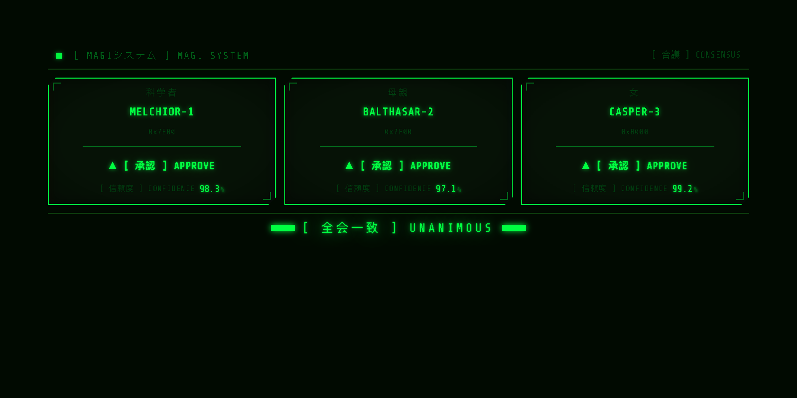</td>
<td align="center"><strong>Radar Sweep</strong><br/>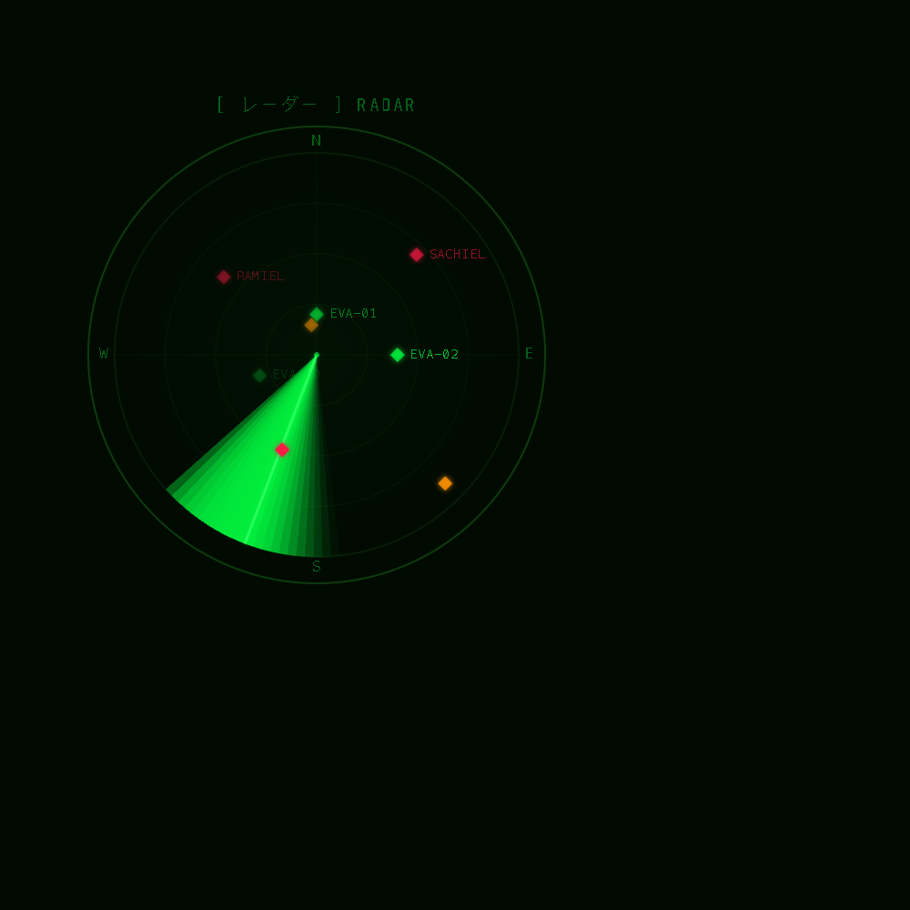</td>
</tr>
<tr>
<td align="center"><strong>Spectrum Analyzer</strong><br/>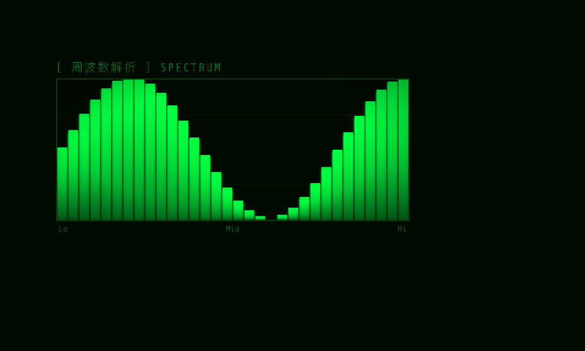</td>
<td align="center"><strong>Pattern Alert</strong><br/>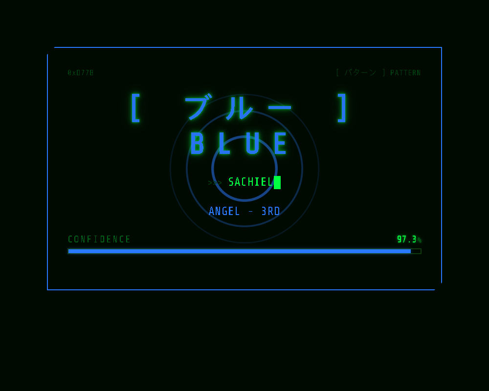</td>
</tr>
<tr>
<td align="center"><strong>Command Terminal</strong><br/>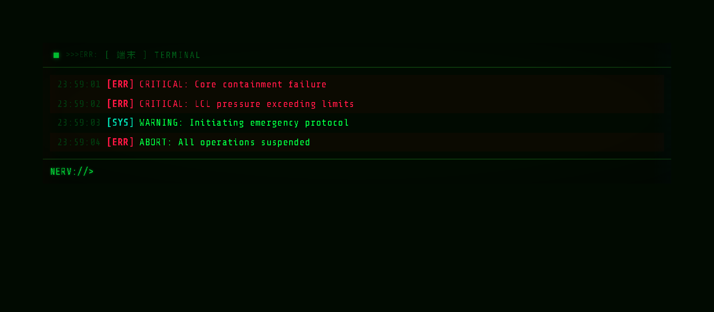</td>
<td align="center"><strong>Sync Gauge</strong><br/>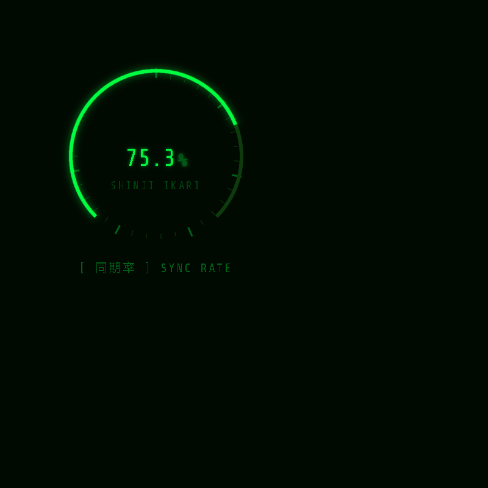</td>
</tr>
<tr>
<td align="center"><strong>Camera Feed</strong><br/>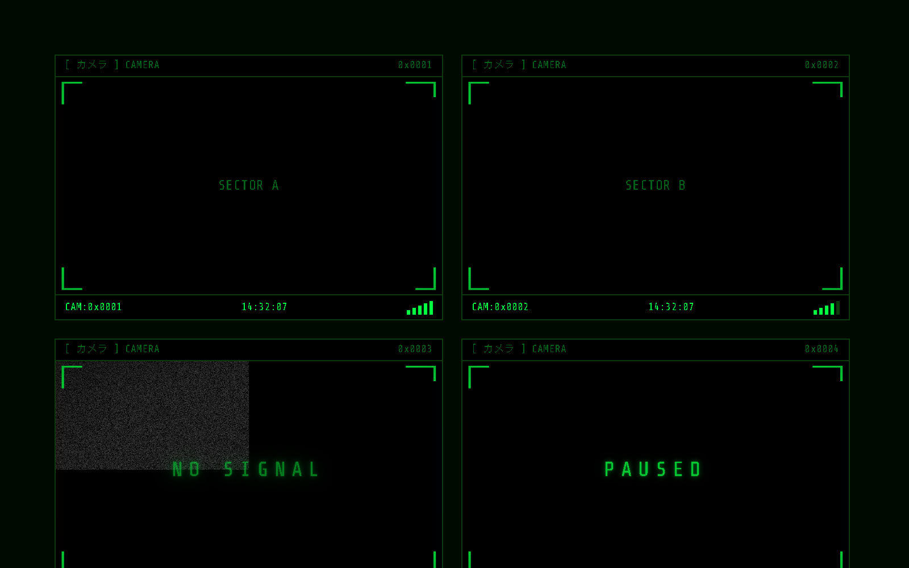</td>
<td align="center"><strong>LCL Depth Meter</strong><br/>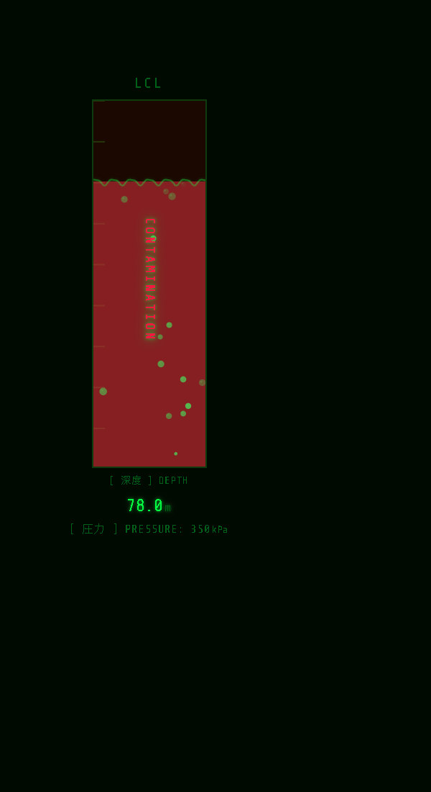</td>
</tr>
<tr>
<td align="center"><strong>Power Grid</strong><br/>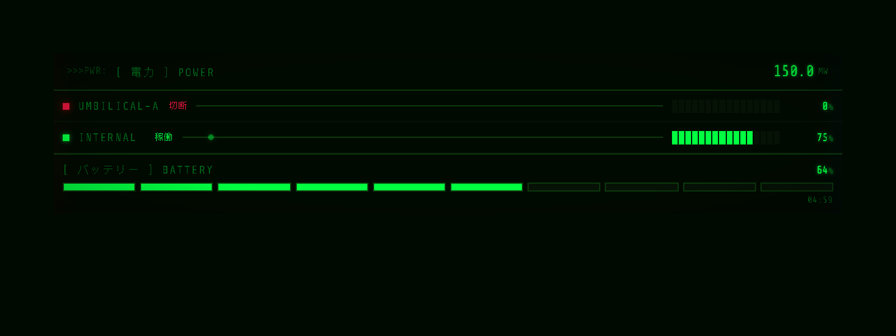</td>
<td align="center"><strong>Waveform Display</strong><br/>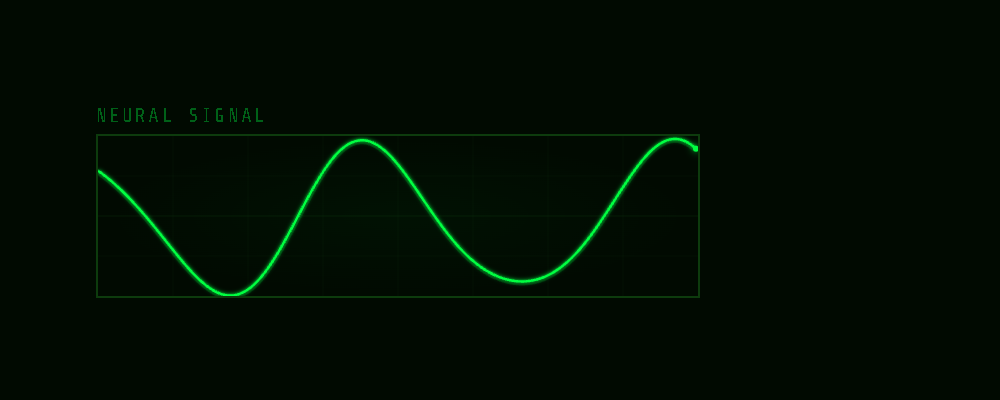</td>
</tr>
<tr>
<td align="center"><strong>Notification Banner</strong><br/>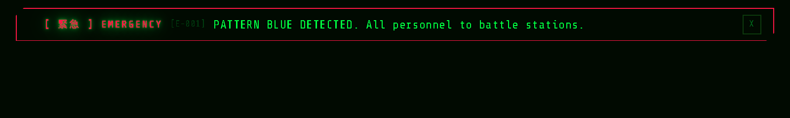</td>
<td align="center"><strong>Status Panel</strong><br/>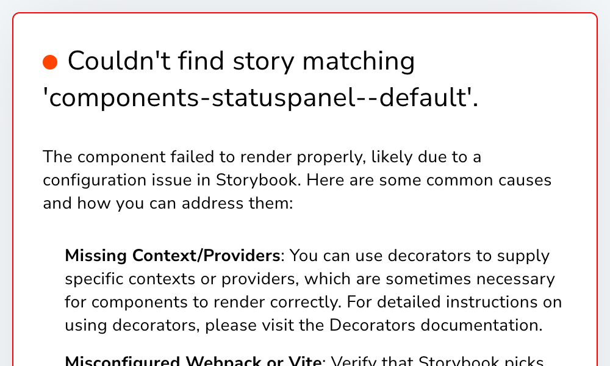</td>
</tr>
</table>

## Tech Stack

| Layer | Technology |
|-------|-----------|
| Framework | React 19 + TypeScript |
| Animation (lifecycle) | Framer Motion |
| Animation (timelines) | anime.js v4 |
| Styling | Tailwind CSS v4 + CSS custom properties |
| Dev / Docs | Storybook 10 |
| Build | Vite 7 |
| Testing | Vitest |

## Components

### Primitives (5)

| Component | Description |
|-----------|-------------|
| `Scanlines` | CRT scanline overlay with chromatic aberration and vignette |
| `Flicker` | Analog display instability effect (subtle/moderate/heavy) |
| `GlowText` | Phosphor bloom text with configurable glow intensity |
| `TypeWriter` | Teletype text reveal with jitter and punctuation pauses |
| `NumberRoll` | Animated numeric display with rolling digit transitions |

### Core (6)

| Component | Description |
|-----------|-------------|
| `StatusPanel` | Bordered panel with SVG draw-on animation and collapsible content |
| `SyncGauge` | Circular synchronization rate gauge |
| `AlertOverlay` | Full-screen alert dialog (info/caution/emergency) |
| `DataReadout` | Key-value data display with trend indicators |
| `ProgressBar` | Segmented/filled/block progress with stagger animations |
| `WaveformDisplay` | Canvas oscilloscope with sine/heartbeat/noise/custom modes |

### Advanced (14)

| Component | Description |
|-----------|-------------|
| `HexGrid` | Hexagonal cell grid with status coloring |
| `TargetReticle` | Animated targeting crosshair |
| `ATFieldDiagram` | AT Field sector integrity display |
| `CountdownTimer` | Countdown with configurable format |
| `SystemLog` | Scrolling log entries with level-colored tags |
| `PatternAlert` | BLUE/ORANGE pattern detection with pulsing rings |
| `MagiConsensus` | Three-node MAGI supercomputer voting visualization |
| `RadarSweep` | Canvas rotating radar with target blips and phosphor decay |
| `SpectrumAnalyzer` | Canvas frequency bar visualizer with peak-hold dots |
| `NotificationBanner` | Stackable notification strips with countdown arcs |
| `CommandTerminal` | Interactive terminal with boot sequence and NERV prompt |
| `CameraFeed` | Security camera panel with canvas noise and corner brackets |
| `PowerGrid` | Power distribution with flow-pulse animations and battery |
| `LCLDepthMeter` | Vertical fluid gauge with canvas wave and bubble effects |

### Composites (3)

| Component | Description |
|-----------|-------------|
| `PilotStatus` | Combined pilot vitals dashboard |
| `MapOverlay` | Map with markers and range circles |
| `EntryPlugHUD` | Full entry plug heads-up display |

## Palettes

Three contextual color palettes, switchable at runtime via `EvaProvider`:

- **Normal** -- green/cyan terminal aesthetic (`#00ff41`)
- **Caution** -- amber/orange warning state (`#ff9100`)
- **Emergency** -- red alert state (`#ff1744`)

## Getting Started

```bash
# Install dependencies
npm install

# Start Storybook
npm run storybook

# Dev playground
npm run dev

# Type check
npm run typecheck

# Run tests
npm run test
```

## Usage

Wrap your app with `EvaProvider`:

```tsx
import { EvaProvider } from "./registry/evangelion/provider";
import { StatusPanel, SyncGauge, MagiConsensus } from "./registry/evangelion/components";

function App() {
  return (
    <EvaProvider palette="normal" locale="ja">
      <StatusPanel title="STATUS" code="001">
        <SyncGauge value={85.7} />
      </StatusPanel>
    </EvaProvider>
  );
}
```

Components work standalone without the provider (sensible defaults apply).

## i18n

All components support Japanese/English dual-label display:

```
locale="ja"  -->  [ 同期率 ] SYNC RATE
locale="en"  -->  SYNC RATE
```

## Project Structure

```
registry/evangelion/
  components/     # All component source files
  primitives/     # Low-level visual building blocks
  hooks/          # Animation and utility hooks
  lib/            # Utils, i18n, animation presets, colors
  provider/       # EvaProvider, context, themes, types
stories/          # Storybook stories
src/              # Dev playground
```

## License

MIT
